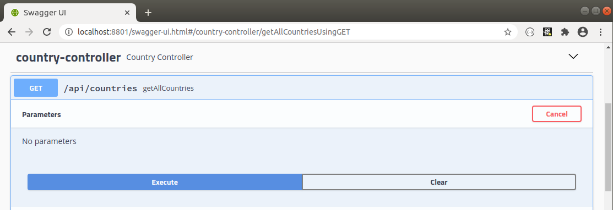
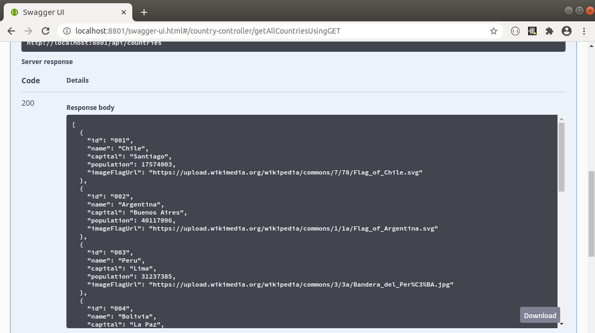

COUNTRIES REST API
--------------------------------------------------------------------------------------------------------------------------

Sencilla API Rest construida con Spring Boot  que permite almacenar y recuperar datos de paises.

--------------------------------------------------------------------------------------------------------------------------

Se genera archivo Dockerfile que permite generar imagen para levantar aplicacion Spring Boot dentro de contenedor Docker:

```

FROM java:8-jdk-alpine

COPY ./target/spring-boot-app-in-docker-0.0.1-SNAPSHOT.jar /usr/src/app/

WORKDIR /usr/src/app

EXPOSE 8801

CMD ["java", "-jar", "spring-boot-app-in-docker-0.0.1-SNAPSHOT.jar"]

```

--------------------------------------------------------------------------------------------------------------------------

Se construye imagen a partir de archivo Dockerfile y se levanta contenedor a partir de la imagen generada:

```

  docker build -t geo-app-in-docker .

  docker run -d -p 8801:8801 geo-app-in-docker

```

--------------------------------------------------------------------------------------------------------------------------

**Se gatilla endpoint que retorna paises desde Swagger UI:**




**Respuesta generada en Swagger UI:**



--------------------------------------------------------------------------------------------------------------------------
